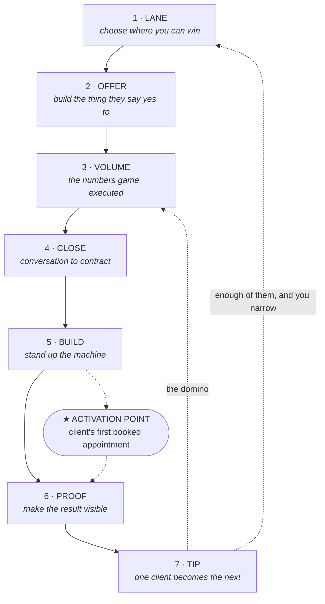

# 02 — The Method

**Phase 2 output. Ends at CHECKPOINT 2.**

---

## Read this first: what this document is

Isaiah has not yet described his actual method. What exists is the `<author_dossier>`, two
beliefs he stated in his own words, and the source curriculum.

So **this is a hypothesis, not a record.** It is the system his dossier and his own sentences
*imply* — assembled so he can correct a draft instead of facing a blank page. That's a faster
road to the real thing, but only if the corrections actually happen.

Three marker types are used throughout, and they are load-bearing:

- **`[CONFIRM]`** — inferred from the dossier. Plausible, unverified. Isaiah says yes/no/adjust.
- **`[GAP]`** — genuinely unknown. Cannot be written until he supplies it.
- **`[NEEDS HIS NUMBER]`** — a metric whose *definition* is sound but whose *target* must come
  from his real data.

**On that last one.** Every stage below says what to measure. None says what "good" looks like.
That's deliberate. Inventing benchmarks — "aim for a 12% reply rate" — is precisely what makes
guru books worthless, and a reader who hits 6% and quits because a made-up number told them
they were failing has been actively harmed. The targets stay blank until Isaiah's own numbers
fill them.

---

## Part 1 — The system

### Naming: five options

| # | Name | The idea | Honest assessment |
|---|---|---|---|
| 1 | **The Domino System** | Isaiah's own phrase. Each client makes the next one easier to get. The first one costs everything; the tenth costs almost nothing | **Recommended.** His word, his mechanism, his story. Inherently sequential, so it maps cleanly onto stages. An 18-28 reader gets it in one beat |
| 2 | **First Domino** | Narrows it to the hardest part — the book is largely about getting client #1 | Strong as a *chapter* or *Part I* title. Too narrow to name a system that runs past client #1 |
| 3 | **The Convergence Method** | Ties to the OneVision mark — four arrows onto one point. Every activity converges on a single number | Visually perfect, verbally cold. Reads corporate consulting, not 22-year-old former running back |
| 4 | **The Rep System** | Athlete framing. You don't get results, you get reps; reps get results | Genuinely on-voice and very ownable. Risk: "reps" also means sales reps, which muddies it in an agency book |
| 5 | **The Numbers Game** | His exact phrase for his core belief | Too generic to own, and it sounds like gambling — wrong connotation for a book about patient work |

### Recommendation: **The Domino System**

It came out of his mouth unprompted, describing what actually happened to him. That's the
strongest claim to a name there is — it isn't branding applied to a business, it's the word the
operator already uses.

It also solves the book's central honesty problem. Most agency programs promise speed. The
domino image promises something truer and more useful: **the first one takes everything you
have, and each one after takes less.** That's the real shape of the thing, it's what his own
"long grind... then one client led to another" describes, and it sets an expectation a reader
won't feel lied to about in week three.

One risk worth naming: dominoes fall on their own, and this system doesn't. The book has to
land the point early that **nothing falls until you tip the first one by hand,** and tipping it
is the hardest labor in the business. Handled well, that tension is the book's spine. Ignored,
the metaphor promises passivity.

### The diagram



Plain-text fallback:

```
  LANE → OFFER → VOLUME → CLOSE → BUILD → PROOF → TIP
                    ↑                ★              │
                    │         (activation point)    │
                    └───────────────────────────────┘
                         each client tips the next
```

**Two things the diagram is saying.**

The loop closes at stage 7 back into stage 3 — that's the domino. A referred lead re-enters at
VOLUME, not at LANE, because you don't re-pick your niche every time. And with enough
dominoes, stage 7 feeds back to stage 1, because that's when you finally have the data to
narrow your lane on purpose instead of by accident. `[CONFIRM]` — this matches "one client led
to another," but only Isaiah knows whether his lane narrowed deliberately or just happened.

The star is the **activation point** — the single moment that predicts whether a client stays.
For a lead-gen agency it is almost certainly *the client's first booked appointment.* Not the
kickoff call, not the dashboard, not the first lead. The first time a real human sits in their
calendar because of work you did. Everything in stage 5 exists to reach that moment faster.
`[CONFIRM]` — Isaiah should sanity-check this against which of his clients stayed and which left.

---

## Part 2 — The seven stages

### Stage 1 · LANE — choose where you can win

| | |
|---|---|
| **Inputs** | A geography you can physically reach. A list of every service vertical inside it |
| **Actions** | Score verticals against four screens: is it growing, can they afford you, are they easy to find, are they in pain. Then apply the two screens that matter more for a beginner — *can you reach the owner directly*, and *is the job worth enough that one extra booked appointment obviously pays your fee* |
| **Tools** | Niche selection scorecard (Phase 5 asset). Google Maps. `[CONFIRM]` — did Isaiah use anything else? |
| **Output** | One vertical, one radius, written down |
| **Metric** | Count of qualifying businesses inside your radius |
| **Target** | `[NEEDS HIS NUMBER]` — how many prospects did Norwood/Bridgewater/South Shore actually yield? |

The four screens are **Hormozi's ideal-customer criteria** (attribute by name). The last two are
the local-agency translation. `[CONFIRM]` — the whole framing here assumes Isaiah picked a lane
deliberately. His "one client led to another" suggests he may have taken what came and the lane
emerged. **If so, say that.** A book that admits the niche came second is more honest and more
useful than one that pretends at a clean start.

`[GAP]` — landscaping, auto detailing, and real estate are all in the dossier. Which came
first, and why those?

### Stage 2 · OFFER — build the thing they say yes to

| | |
|---|---|
| **Inputs** | The chosen vertical's actual pain. What an appointment is worth to them |
| **Actions** | Build an appointment-based offer. Price it against the value of one closed job, not against what other agencies charge. Decide setup fee vs. retainer vs. per-appointment |
| **Tools** | Offer builder worksheet, three-tier pricing calculator (Phase 5 assets) |
| **Output** | One offer, one price, one sentence you can say out loud |
| **Metric** | Close rate on offers presented |
| **Target** | `[NEEDS HIS NUMBER]` |

Teaching note: **value-based over competitor-based pricing** — attribute the framing to Hormozi,
teach Isaiah's application. The local-service translation is concrete and strong: if a
landscaper closes 1 in 3 estimates and a job is worth $4,000, then one extra booked estimate a
week is roughly $70,000 a year. Price against *that*, not against the other agency charging
$500 a month.

`[GAP]` — **everything about Isaiah's actual pricing.** What he charged client #1, what he
charges now, whether he uses setup fees, and the moment he raised his price. This is question 4
and the chapter can't be written without it.

`[CONFIRM]` — one high-value idea from the source curriculum worth applying: **match billing
cadence to value cadence.** A GoHighLevel build is one-time value and should carry a one-time
fee; ongoing management is ongoing value and should be the retainer. Agencies that bundle both
into one monthly number get fired the first slow month, because clients judge you on the last
billing cycle, not the relationship. Does Isaiah price this way?

### Stage 3 · VOLUME — the numbers game, executed

| | |
|---|---|
| **Inputs** | A built list of prospects in your lane |
| **Actions** | A fixed, non-negotiable daily touch count across the channels that actually work in your market. Every touch logged in a pipeline stage, not in your head |
| **Tools** | GoHighLevel pipeline. Cold outreach scripts — DM, email, call opener, walk-in (Phase 5) |
| **Output** | Booked discovery calls |
| **Metric** | Touches → replies → booked calls. Three numbers, tracked daily |
| **Target** | `[NEEDS HIS NUMBER]` — out of 100 touches, how many reply and how many book? |

**This is the stage carrying Isaiah's stated core belief.** "It's all a numbers game" is not
motivational filler here, it's the operating instruction: pick the number, hit it whether or not
you feel like it, and let the math run long enough to work.

`[GAP]` — which channel actually produced clients. DMs, cold calls, email, walk-ins? The
dossier lists Instagram and TikTok handles, which hints at DM-first, but that's a guess.
`[GAP]` — real daily volume, and 2–3 messages that actually worked, exactly as sent.

Compliance, load-bearing: any SMS touch requires A2P 10DLC registration — carriers have
**blocked** unregistered traffic outright since February 2025. Cold texting without it doesn't
underperform, it doesn't arrive. See `01b-verification.md`.

### Stage 4 · CLOSE — conversation to contract

| | |
|---|---|
| **Inputs** | A booked discovery call |
| **Actions** | Qualify before pitching. Diagnose their current lead flow. Present the offer. Handle objections. Send the agreement same day |
| **Tools** | Discovery call framework + question bank, objection one-pager, proposal template, MSA/SOW (Phase 5) |
| **Output** | Signed agreement |
| **Metric** | Show rate, then close rate. Track both — close rate alone rewards cherry-picking |
| **Target** | `[NEEDS HIS NUMBER]` |

`[GAP]` — **Isaiah's discovery structure and his real objections.** No source PDF contains a
single objection. Every one has to come from his actual calls, in the words South Shore owners
actually use. This is the highest-value gap in the entire book, because objection handling is
what buyers say they'll pay for.

Compliance: if calls are recorded, **M.G.L. c. 272 § 99** applies to any recording made in
Massachusetts. The statute turns on *secrecy* — announce it at the top and you're compliant.
It's a felony if you don't. Worth teaching the reason, not just the script line.

### Stage 5 · BUILD — stand up the machine

| | |
|---|---|
| **Inputs** | Signed client. Access to their systems |
| **Actions** | A2P 10DLC brand and campaign registration **first**, because it gates everything else. Then pipeline stages, automations, Conversation AI, calendar, intake. Onboarding call that sets expectations and schedules the next contact |
| **Tools** | GoHighLevel — snapshot, workflows, Conversation AI. Client onboarding checklist day 0→14 (Phase 5) |
| **Output** | A live machine producing leads |
| **Metric** | **Time to the client's first booked appointment.** This is the activation point |
| **Target** | `[NEEDS HIS NUMBER]` — how fast does Isaiah get a new client their first appointment? |

**This stage decides retention, which is why it sits where it does.** A2P registration takes
1–3 business days for a brand and 3–7 for a campaign, stretching to 10–15 in busy periods. If
that clock starts on day one, it's invisible. If it starts in week three, the client spends
three weeks paying for silence — and silence in month one is why agencies get fired in month two.

`[GAP]` — the entire GoHighLevel build. Exact pipeline stage names, which automations fire on
which triggers, how Conversation AI is prompted and where it hands to a human, what's in the
snapshot. This is question 7 and it's what makes the book un-copyable.

`[GAP]` — Isaiah's own A2P registration story. What got rejected, how long it really took, what
he'd do differently. Nobody teaches this well. It could be the best chapter in the book.

### Stage 6 · PROOF — make the result visible

| | |
|---|---|
| **Inputs** | A running machine and its data |
| **Actions** | Report on a fixed cadence, in the client's language — booked appointments and jobs won, not impressions and CTR. Show the number they care about next to what it cost |
| **Tools** | Weekly reporting template, KPI dashboard definitions (Phase 5) |
| **Output** | A client who can see what they're paying for |
| **Metric** | Appointments delivered, cost per appointment, and client-reported closed jobs |
| **Target** | `[NEEDS HIS NUMBER]` |

The mechanism worth teaching: clients judge you inside the **lookback window of the last
billing cycle,** not across the relationship. A great month in January buys nothing in March.
Reporting exists to keep the window full — attribute the framing to Hormozi, teach the agency
application.

Compliance: results shown to a client's customers fall under the **FTC Endorsement Guides**
(revised July 2023) — claims must be truthful and represent typical results. And in
Massachusetts, overpromising in a proposal isn't just sloppy: **c. 93A § 11** exposes
business-to-business deception to treble damages plus attorney's fees. That's the real argument
for conservative promises, and it's a better one than "be professional."

### Stage 7 · TIP — one client becomes the next

| | |
|---|---|
| **Inputs** | A client with a visible result |
| **Actions** | Ask for the referral at the moment the result lands, not at renewal. Capture the testimonial while they're happy. Book the next check-in before ending the current one |
| **Tools** | Retention/QBR script, referral ask, testimonial capture (Phase 5) |
| **Output** | A warm introduction — which re-enters at stage 3, already halfway closed |
| **Metric** | Referrals per client, and months retained |
| **Target** | `[NEEDS HIS NUMBER]` — Isaiah's actual referral rate and longest-retained client |

**This is the domino, and it's the whole thesis.** A referred prospect skips most of stage 3
and much of stage 4. That's why client #10 costs almost nothing next to client #1 — and why
the answer to a slow month is usually delivery, not more prospecting.

Two mechanisms from the curriculum, applied: **book the next meeting during the current meeting**
(Sharran Srivatsaa's BAMFAM, via Hormozi) — never end on "I'll follow up." And watch **usage
churn**: the client who stopped opening the dashboard has already left, they just haven't
cancelled yet.

`[GAP]` — question 3. Who was client #2 and how exactly did client #1 produce them? Referral,
visible results, someone talking? **The precise mechanism is the engine of the book.** Get this
right and the spine holds.

---

## Part 3 — Unfair advantages → transferable skills

The point of this section is that none of these stay locked to Isaiah. Each converts into
something a reader can build.

| # | His advantage | The transferable skill | Confidence |
|---|---|---|---|
| 1 | Four years of collegiate football conditioning — work capacity independent of mood | **A daily rep count that doesn't negotiate with how you feel.** Outreach volume as a number you hit, like a lift you don't skip | Strong — supported by his own "numbers game" belief |
| 2 | Built the agency *while* a full-time student and varsity athlete | **Time-boxing.** Proof the business fits into constrained hours — which is the single most relevant fact about him for a reader still in school or working a job | Strong — this is the dossier's clearest fact |
| 3 | Film study — an athlete's normal habit of watching his own reps | **Reviewing your own recorded calls weekly.** Almost no beginner does this; every athlete already knows how | `[CONFIRM]` — does he actually review calls? |
| 4 | Local and known. Norwood, Bridgewater, South Shore. He can drive there and walk in | **Geographic density as an advantage.** The walk-in is available to a 22-year-old and unavailable to an overseas competitor charging half | `[CONFIRM]` — did he actually do walk-ins? |
| 5 | Studying marketing formally while running the agency | **Same-week application.** Learn it Tuesday, ship it Thursday, keep what worked | `[CONFIRM]` |
| 6 | Team-sport background — coachable, comfortable with roles and being corrected | **Taking client feedback without ego.** A client saying the leads are bad is a coach's note, not an insult | `[CONFIRM]` |

`[GAP]` — All-Conference and the 2023 MASCAC championship are in the dossier but no **scene**
exists. The book needs one specific moment: a coach, a practice, a number on a board. Often the
useful one is smaller than the trophy — a Tuesday nobody watched.

---

## Part 4 — Five beliefs most beginners get wrong

These are the contrarian hooks — the lines a reader repeats to a friend.

### 1. It's all a numbers game — and almost everyone quits before the math gets a chance

**Isaiah's, in his own words.** Confirmed.

> "if you put the work in eventually enough return will come back to you to where it feels
> rewarding"

The contrarian edge isn't "do more outreach," which everyone says. It's the word *eventually*.
Beginners treat a bad week as evidence the method is broken, when the method's whole premise is
that the return arrives after the volume, not during it. The honest version of this belief also
refuses to promise speed — which is what makes it trustworthy.

**Against:** "find the script that converts," "this hack got me 10 clients in 30 days."

### 2. The first client is the hardest thing you will ever do in this business — and it's supposed to be

Derived from his "long grind... then one client led to another." `[CONFIRM]`

Every program sells the first client as easy and the tenth as hard. It's the reverse. Client #1
has no proof, no referral, no case study, no confidence. Client #10 arrives warm. **A beginner
who knows the curve is front-loaded survives the part that makes everyone else quit.**

**Against:** "get your first client in 7 days."

### 3. You probably won't pick your niche. Your niche will pick you — and that's fine

`[CONFIRM]` — inferred from "one client led to another," and directly contradicted by most
teaching, including the source material's own advice.

Every course opens with pick-a-niche and beginners freeze there for months. If Isaiah's lane
actually emerged from whoever said yes first, **saying so out loud releases the reader's
handbrake.** Pick a defensible direction, take the client, let the lane sharpen with data.

**Against:** "you must niche down before you start." **Isaiah has to confirm this one** — if he
did pick deliberately, the belief gets cut rather than bent.

### 4. Your client's first booked appointment is the entire relationship

Derived from the activation-point method in the source curriculum, applied to an agency.
`[CONFIRM]` against his own retention history.

Not the kickoff call. Not the dashboard. Not the first lead. **The first time a real person sits
in their calendar because of you.** Everything before it is promise; everything after is proof.
Which means speed to that moment is the highest-leverage variable in delivery — and A2P
registration, boring as it is, sits directly on the critical path.

**Against:** "onboard properly, report monthly, hope."

### 5. Getting fired is a delivery problem wearing a marketing costume

Derived from the retention curriculum. `[CONFIRM]`

When a client leaves, the reflex is to prospect harder. But churn compounds against you: leave
it alone and you run to stand still. And the fix is usually unglamorous — the client stopped
seeing results, or stopped seeing *evidence* of results, weeks before they said anything.

**Against:** "just fill the top of the funnel."

### Bench — a sixth, if one of the above gets cut

**Speed beats polish, every time.** Beginners build the perfect funnel, logo, and website before
talking to a single business. `[CONFIRM]` — does this match how Isaiah started? If OneVision
began scrappy and got polished later, this is a strong sixth and possibly a stronger fourth.

---

## 🛑 CHECKPOINT 2 — what Isaiah needs to decide

1. **System name.** The Domino System, or one of the other four?
2. **Seven stages** — right number, right order, right names? Anything missing, anything that
   should merge?
3. **The activation point** — is a client's first booked appointment really the moment that
   predicts whether they stay? Check it against who stayed and who left.
4. **Belief #3 is the risky one.** Did the lane pick him, or did he pick it? If he picked it
   deliberately, that belief gets cut, not softened.
5. **The `[CONFIRM]` markers** in Part 3 — which advantages are real, which did I invent by
   pattern-matching an athlete?

**And still open from CHECKPOINT 1: questions 1, 2, and 3.** The first yes, the grind before it,
and how client #1 produced client #2. Stage 7 and beliefs 1–3 are all resting on inference until
those land.
